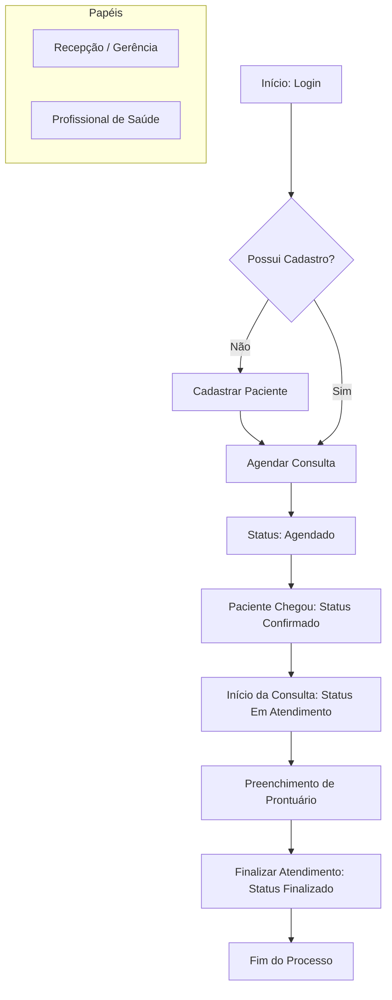

# Documentação Técnica - SOLUS One

Este documento detalha os requisitos e o fluxo de funcionamento do sistema **SOLUS One**, uma plataforma completa de gestão de saúde.

---

## 1. Requisitos Funcionais (RF)

Os requisitos funcionais descrevem as funcionalidades e serviços que o sistema deve fornecer.

| ID | Requisito | Descrição |
| :--- | :--- | :--- |
| **RF01** | **Autenticação e Autorização** | Permite login via e-mail/senha com controle de acesso (RBAC) para ADMIN, GERENTE, PROFISSIONAL e RECEPCAO. |
| **RF02** | **Gestão de Usuários** | Cadastro, edição, listagem e controle de status (ativo/inativo) de usuários do sistema. |
| **RF03** | **Gestão de Profissionais** | Cadastro de médicos e outros profissionais, vinculando-os a especialidades e registros profissionais (CRM, etc). |
| **RF04** | **Cadastro de Especialidades** | Manutenção das especialidades médicas atendidas na clínica. |
| **RF05** | **Gestão de Pacientes** | Prontuário cadastral contendo dados pessoais, contatos, endereço e informações de convênio. |
| **RF06** | **Gestão de Convênios** | Cadastro de operadoras de saúde e planos integrados aos pacientes. |
| **RF07** | **Configuração de Agenda** | Definição de horários de atendimento (grade horária) por profissional e dia da semana. |
| **RF08** | **Agendamento de Consultas** | Marcação de consultas vinculando paciente, profissional e horário disponível. |
| **RF09** | **Controle de Status** | Gestão do ciclo de vida da consulta: *Agendado -> Confirmado -> Em Atendimento -> Finalizado -> Cancelado*. |
| **RF10** | **Registro de Atendimento** | Prontuário eletrônico para preenchimento de queixa, histórico, exame físico, diagnóstico e prescrição. |
| **RF11** | **Histórico Clínico** | Acesso rápido a todos os atendimentos passados de um paciente específico. |
| **RF12** | **Dashboard de Indicadores** | Painel visual com métricas de atendimentos, agendamentos do dia e novos pacientes. |

---

## 2. Requisitos Não Funcionais (RNF)

Os requisitos não funcionais definem critérios que podem ser usados para julgar a operação de um sistema.

- **RNF01 - Segurança:** Autenticação baseada em **JWT (JSON Web Token)** e criptografia de senhas.
- **RNF02 - Arquitetura Backend:** Desenvolvido em **Java 21** utilizando o framework **Spring Boot 4.0.2**.
- **RNF03 - Arquitetura Frontend:** Interface construída com **Angular 21** e **Angular Material**.
- **RNF04 - Persistência de Dados:** Uso de banco de dados relacional **PostgreSQL**.
- **RNF05 - Responsividade:** O frontend deve ser totalmente adaptável para desktops, tablets e smartphones.
- **RNF06 - Desempenho:** Respostas de API otimizadas e carregamento de listas com paginação/filtros eficientes.
- **RNF07 - Manutenibilidade:** Código organizado em camadas (Controller, Service, Repository, Entity, DTO).

---

## 3. Fluxo do Processo (Workflow)

O fluxo abaixo representa o ciclo padrão de um paciente dentro do sistema, desde o primeiro contato até o pós-atendimento.

### Fluxo Textual
1.  **Autenticação:** O usuário (Administrativo ou Profissional) realiza o login.
2.  **Recepção:**
    *   Verifica se o paciente já possui cadastro. Se não, realiza o **Cadastro de Paciente**.
    *   Acessa o módulo de **Agendamento**, seleciona o profissional e reserva um horário vago.
3.  **Chegada:**
    *   No dia da consulta, a recepção marca o status do agendamento como **Confirmado**.
4.  **Atendimento Médico:**
    *   O profissional visualiza o paciente na lista de espera.
    *   Inicia o atendimento (Status: **Em Atendimento**).
    *   Preenche o **Prontuário Eletrônico** com dados clínicos e prescrições.
    *   Finaliza o atendimento (Status: **Finalizado**).
5.  **Encerramento:**
    *   O prontuário fica disponível no histórico para consultas futuras.

### Fluxo Visual (Mermaid)

---

## 4. Regras de Negócio (RN)

As regras de negócio definem as condições e restrições sob as quais o sistema opera.

### 4.1. Agendamentos
- **RN-AG01 (Data Retroativa):** Não é permitido realizar agendamentos em datas ou horários passados.
- **RN-AG02 (Conflitos):** O sistema impede o agendamento de dois pacientes no mesmo horário para o mesmo profissional.
- **RN-AG03 (Janela de Atendimento):** Agendamentos só podem ser realizados dentro dos horários definidos na grade (agenda) do profissional.
- **RN-AG04 (Status do Paciente):** Somente pacientes com cadastro marcado como "Ativo" podem agendar consultas.
- **RN-AG05 (Cancelamento de Realizados):** Um agendamento com status "Realizado" não pode ser cancelado.
- **RN-AG06 (Multitenancy):** Um usuário só pode visualizar e gerenciar agendamentos pertencentes à sua própria empresa (clínica).

### 4.2. Atendimentos e Prontuários
- **RN-AT01 (Responsabilidade):** Apenas o profissional de saúde vinculado ao agendamento (ou um Administrador) tem permissão para preencher o prontuário.
- **RN-AT02 (Unicidade):** Cada agendamento permite a criação de apenas um registro de atendimento.
- **RN-AT03 (Início de Atendimento):** Não é permitido iniciar atendimento para agendamentos com status "Cancelado" ou "Não Compareceu".
- **RN-AT04 (Finalização Automática):** Ao concluir o preenchimento do prontuário, o agendamento correspondente deve ter seu status alterado para "Realizado".
- **RN-AT05 (Exclusão de Prontuário):** Por segurança, a exclusão de históricos de atendimento é restrita exclusivamente ao perfil de Administrador.

---

## 5. Casos de Uso (UC)

Principais interações entre os atores e o sistema.

### 5.1. Ator: Recepção / Comercial
- **UC01 - Gestão Cadastral:** Cadastrar e atualizar dados de pacientes e seus convênios.
- **UC02 - Gestão de Agenda:** Consultar disponibilidade de horários e realizar a marcação de consultas.
- **UC03 - Recepção do Paciente:** Confirmar a chegada do paciente e atualizar o status para que o médico visualize a espera.
- **UC04 - Gestão de Cancelamentos:** Processar pedidos de desistência de consultas.

### 5.2. Ator: Profissional de Saúde
- **UC05 - Atendimento Clínico:** Iniciar o atendimento, mudar o status para "Em Atendimento" e realizar a anamnese.
- **UC06 - Registro de Evolução:** Preencher diagnóstico, prescrições e orientações no prontuário eletrônico.
- **UC07 - Consulta de Histórico:** Revisar atendimentos e exames anteriores do paciente para apoio ao diagnóstico atual.
- **UC08 - Encerramento de Consulta:** Finalizar o atendimento e liberar o paciente.

### 5.3. Ator: Administrador
- **UC09 - Configuração do Sistema:** Gerenciar usuários, especialidades, convênios e configurações gerais da clínica.
- **UC10 - Definição de Grades:** Configurar os dias e horários de trabalho de cada profissional de saúde.
- **UC11 - Painel de Controle (Dashboard):** Analisar volume de atendimentos, taxa de absenteísmo e produtividade por profissional.

---

## 6. Cronograma de Desenvolvimento e Checklist

O projeto está estruturado em 5 etapas principais de entrega, totalizando 30 dias de desenvolvimento.

### 🗓️ Dia 02: Fundação e Segurança (Core)
- [x] Configuração inicial do ambiente Monorepo.
- [x] Implementação do Multitenancy (Isolamento por Empresa).
- [x] Sistema de Autenticação JWT e Perfis de Acesso (RBAC).
- [x] CRUD de Usuários e Gestão de Permissões.

### 🗓️ Dia 09: Gestão Cadastral (Base)
- [x] Módulo de Cadastro de Pacientes.
- [x] Gestão de Operadoras de Saúde e Convênios.
- [x] Cadastro de Especialidades Médicas.
- [x] Listagem e busca avançada de profissionais e pacientes.

### 🗓️ Dia 16: Agendamento Inteligente (Booking)
- [x] Definição de Grades de Horários (Calendário de Trabalho).
- [x] Lógica de verificação de disponibilidade em tempo real.
- [x] Agendamento de consultas e controle de status (Agendado/Cancelado).
- [x] Interface de Calendário Visual (FullCalendar).

### 🗓️ Dia 23: Ciclo Clínico (Health Record)
- [] Início de Atendimento e Triagem.
- [] Prontuário Eletrônico Completo (Anamnese, Exame Físico, Diagnóstico).
- [] Gerenciamento de Prescrições e Orientações.
- [] Consulta ao Histórico de Atendimentos passados.

### 🗓️ Dia 30: Gestão e Finalização (Management)
- [] Dashboard Administrativo com indicadores chave (KPIs).
- [] Funcionalidade de exportação de atendimentos para PDF.
- [] Refinamentos de UX/UI e responsividade mobile.
- [] Documentação final e preparação para deploy.

---

## 7. Tecnologias Utilizadas

### Backend
- **JDK 21**
- **Spring Boot 4.0.2**
- **Spring Security + JWT**
- **Spring Data JPA**
- **Lombok**
- **PostgreSQL**

### Frontend
- **Angular 21**
- **Angular Material**
- **FontAwesome 7**
- **Chart.js (Dashboard)**
- **FullCalendar (Agendas)**
